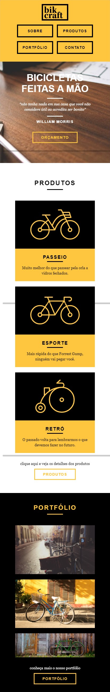
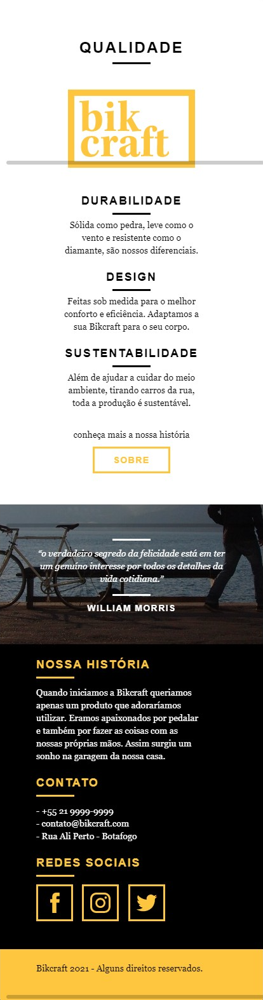
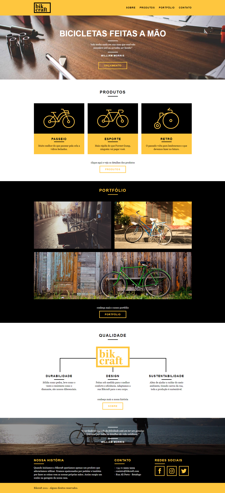
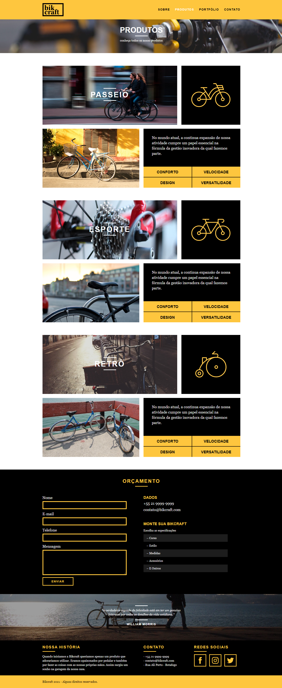

  

  

   
  
    
   

  
  

<h1 align="center">
    
</h1>

<h4 align="center"> 
	🚧  Bikcraft 🚴‍♂️ Concluído  🚧
</h4>

 <a href="#💻-sobre-o-projeto">Sobre</a> •
 <a href="#🎨-layout">Layout</a> • 
 <a href="#🚀-como-executar-o-projeto">Como executar</a> • 
 <a href="#🛠-tecnologias">Tecnologias</a> • 
 <a href="#🦸-autor">Autor</a> • 
 <a href="#📝-licença">Licença</a>

## 💻 Sobre o projeto

Bikcraft - é um site feito para que pessoas possam comprar bicicletas personalizadas para os mais diversos propósitos.

O projeto foi desenvolvido durante o curso de **Web Design Completo** da [Origamid](https://www.origamid.com/).
A Origamid é uma plataforma online com atualmente 20 cursos e um total de 1017 aulas ministradas pelo professor André Rafael.

---

## 🎨 Layout

O layout da aplicação está disponível no Figma:

### Mobile

  

  

### Web

  

  

---

## 🚀 Como executar o projeto

Este projeto é composto apenas pelo Frontend.

### Pré-requisitos

Antes de começar, você vai precisar ter instalado em sua máquina o
[Git](https://git-scm.com). Além disto é bom ter um editor para trabalhar com o código como [VSCode](https://code.visualstudio.com/)

#### 🧭 Rodando a aplicação

Sinta-se a vontade caso queira rodar este projeto direto no seu browser clicando com o botão direito no arquivo index.html e, em seguida, selecionando a opção Abrir Com e selecionando o navegador de sua preferência.

---

## 🛠 Tecnologias

As seguintes ferramentas foram usadas na construção do projeto:

#### **Website**

-   **[HTML](https://developer.mozilla.org/pt-BR/docs/Web/HTML)**
-   **[CSS](https://developer.mozilla.org/pt-BR/docs/Web/CSS)**
-   **[Javascript](https://developer.mozilla.org/pt-BR/docs/Web/JavaScript)**
-   **[PHP](https://www.php.net/)**

#### **Utilitários**

-   Protótipo:  **[Figma](https://www.figma.com/)**  →  **[Protótipo (Bikcraft)](https://www.figma.com/file/qEu2G6u5SZSAZnIU2F7aR8/bikcraft-design?node-id=0%3A1)**
-   Editor:  **[Visual Studio Code](https://code.visualstudio.com/)**
-   Serviço de envio de email:  **[SendGrid](https://sendgrid.com)** / **[PHPMailer](https://github.com/PHPMailer/PHPMailer)**
-   Fontes:  **[Arial](https://www.fonts.com/font/monotype/arial?QueryFontType=Web&src=GoogleWebFonts)**,  **[Georgia](https://www.fonts.com/font/microsoft-corporation/georgia?QueryFontType=Web&src=GoogleWebFonts)**

---

## 🦸 Autor

<a href="https://www.linkedin.com/in/matheus-calixto-silva/">
 
  
 <b>Matheus Calixto</b></a> 
  

 

---

## 📝 Licença

Este projeto esta sobe a licença [MIT](./LICENSE).

Feito com ❤️ por Matheus Calixto 👋🏽 [Entre em contato!](https://www.linkedin.com/in/matheus-calixto-silva/)